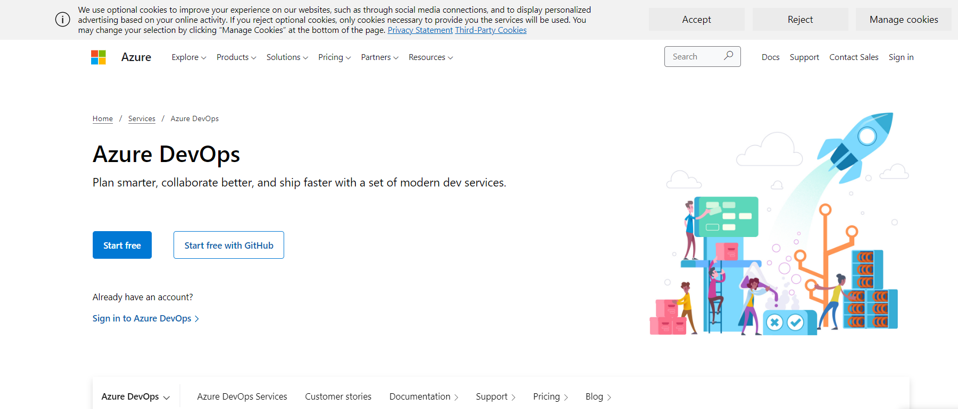
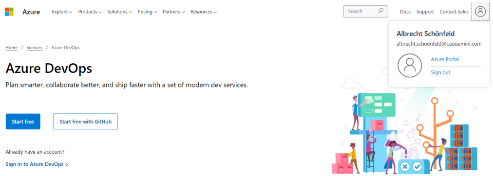
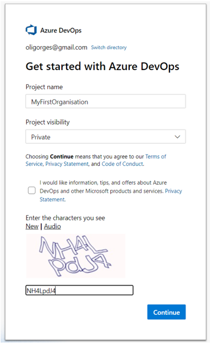
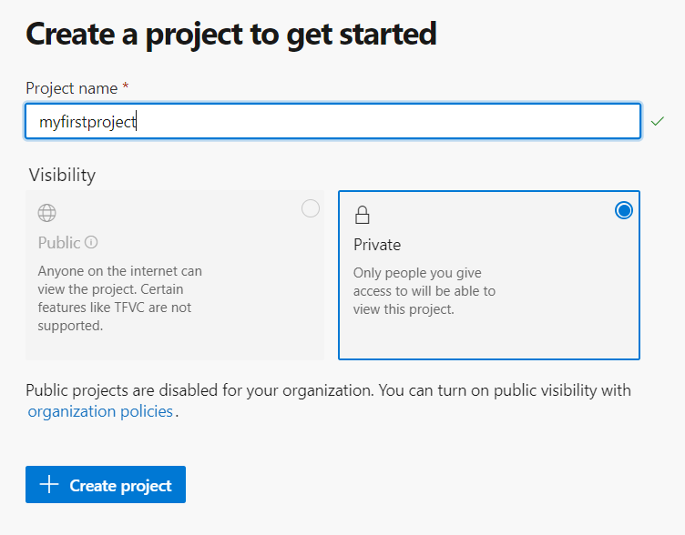
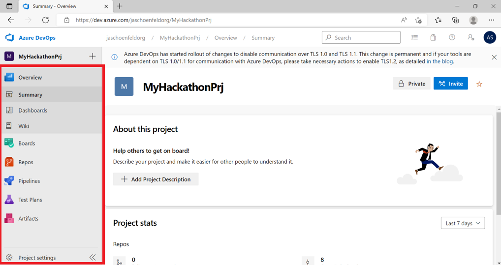

# 1. Introduction to Azure DevOps

Azure DevOps is a Software as a service (SaaS) platform from Microsoft that provides an end-to-end DevOps toolchain for developing and deploying software. It also integrates with most leading tools on the market and is a great option for orchestrating a DevOps toolchain. So far Azure DevOps has been the main enterprise grade toolchain offering for DevOps. However, with the acquisition of GitHub things will change in the long run. The new announced successor will be GitHub and GitHub actions.

# 2. Setting up Azure DevOps

## Sign in to Azure DevOps

If you have already used Azure DevOps you can just use an existing organization and add a new project.

> **Warning**
> You only get a limited amount of free minutes per month to run pipelines. If you use an existing account **MAKE SURE** there are **ENOUGH FREE MINUTES LEFT**. If you are not sure create use a new account (Also a non-CapGemini email account is possible).

The following steps describe a general way how you can navigate to an already existing organization or create a new one. If you know the name of your organization you can also directly jump to the management portal for Azure DevOps organizations that have the URL `https://dev.azure.com/<name of your organization>`:
- Go to https://dev.azure.com/

  The picure below shows the initial screen. It states "Sign in" on the right-hand side if you are not yet signed in.
    

- Login in with your account

  Click “Sign in” on the Top Right Corner. Select your existing organisation account or enter your Company Mail Address for a new one when prompted. When you are successfully signed in you are redirected to https://dev.azure.com again.
    

## Navigate to/ Create the Azure DevOps Organization

Click "Start Free" to continue. If you have already created an organization before you will be redirected there. Otherwise you will be prompted for the details to create one. An organization is the top level entity that hosts your projects. State the name of your organization and select "Private as project visibility when prompted as shown below:
  

## Create a new Azure Devops Project

After you setup your Organization, setup a new Project inside of it.

  

The screenshot below shows the home of your new project after successful creation.

  

The left-hand side contains the major navigation entries. Relevant in this hackathon are:
- the rocket symbol for pipelines
- the git symbol for git repositories
- project settings at the bottom

For further informtation about Azure Devops Projects visit this [Website](https://docs.microsoft.com/en-us/azure/devops/organizations/projects/create-project?view=azure-devops&tabs=browser)
