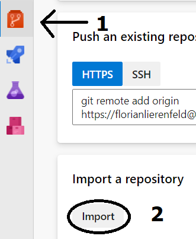

# How to setup a new Project in Azure Devops

# General

## What is Azure DevOps?

Azure DevOps is a Software as a service (SaaS) platform from Microsoft that provides an end-to-end DevOps toolchain for developing and deploying software.  It also integrates with most leading tools on the market and is a great option for orchestrating a DevOps toolchain.

## Create a new Azure DevOps Organization

First you need to Setup your own Organization in Azure DevOps or use an existing one in you Account

Visit the [Azure Devops Portal](https://dev.azure.com/) and follow these [instructions](https://docs.microsoft.com/en-us/azure/devops/organizations/accounts/create-organization?view=azure-devops).

## Create a new Azure Devops Project

After you Setup your Organization, setup a new Project inside of it.

  

For further informtation about Azure Devops Projects visit this [Website](https://docs.microsoft.com/en-us/azure/devops/organizations/projects/create-project?view=azure-devops&tabs=browser)

## Setup your Git Project in Azure DevOps

First you need to select the Organe Repository Symbol on the left hand Side and then Initialize it on the bottom Right. 

  

After this Step you may Continue with how to Setup Git Locally
