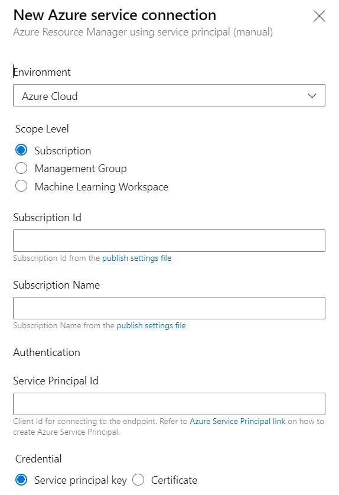

# How to setup a new Service Connections in Azure Devops

# General

## What is are Azure DevOps Service Connections?

Service Connections Store User Credentials that are used to Authenticate the DevOps Pipeline against an Environment in our case this is Azure.

[Microsoft Docs AzDevOps Service Connections](https://docs.microsoft.com/en-us/azure/devops/pipelines/library/service-endpoints?view=azure-devops&tabs=yaml)

## How to Setup Service Connections?

Please read the following 5 Instructions carefully before continuing.

1. In your Project you can fint the Project Settings on the Bottom Left. 

> Note the Side Menu might be collabsed on your Screen 

Open Project Settings:
  

2. Select Service Connections:

> You might need to Scroll down in the List

  

3. Select Azure Resourcee Manager Scroll down and Click Next.

  

4. You will need to Select Service Principal Manual to use the Azure Subscription we provided. 

  

5. Ask for the Required Credentials to create the Service Connection

  