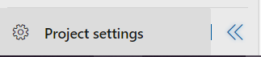
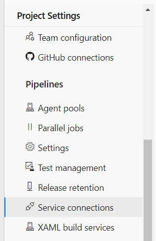
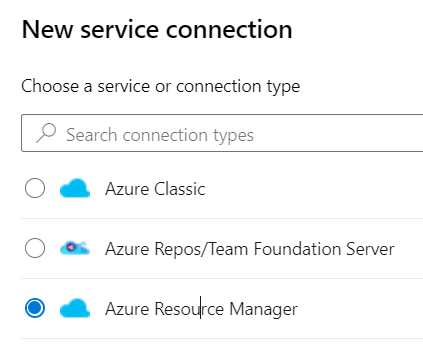
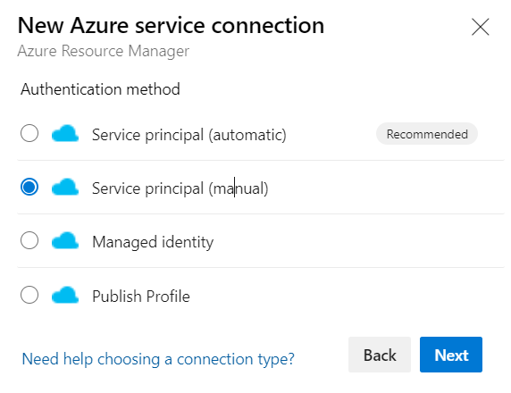
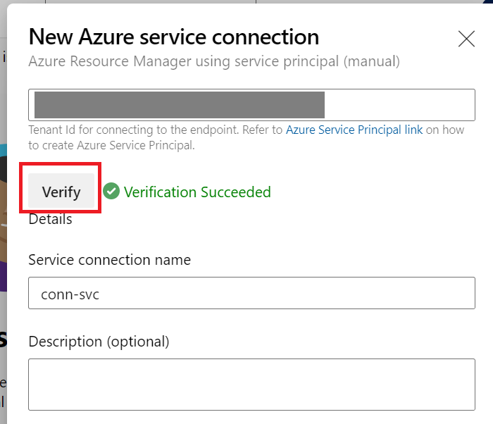

# 1. Introduction to Service Connections

You should now have Completed the Following things:
1. Setup your Azure DevOps Organization/ Project
2. Setup your Azure DevOps Repository

Next you will set up an Azure DevOps Service Connection. Service Connections Store User Credentials that are used to Authenticate the DevOps Pipeline against an Environment in our case this is Azure.

[Microsoft Docs AzDevOps Service Connections](https://docs.microsoft.com/en-us/azure/devops/pipelines/library/service-endpoints?view=azure-devops&tabs=yaml)

# 2. Setting up the Service Connection

Please read the following 5 Instructions carefully before continuing.

1. In your Project you can find the Project Settings on the Bottom Left. 

> Note the Side Menu might be collabsed on your Screen 

Open Project Settings:
  

2. Select Service Connections:

> You might need to Scroll down in the List

  

3. Select Azure Resourcee Manager Scroll down and Click Next.

  

4. Select "Service Principal (Manual)" to use the Azure Subscription we provided and Click Next.

  

5. Regarding the settings we can **start with the defaults** as shown below (Screenshot shows only first half of the form). The service connection name you can choose yourself and will be required later. The following values we will paste in the chat during the hands-on session: Subscription (Id/ Name), Service Principal (id/ key) and Tenant id

  

6. Test the connection by clicking the "Verify" at the button of the wizard. If you get a success message you can successfully access Azure with the service principal we already setup for you.

  

7. Click "Verify and Save" at the bottom to trigger the creation of the service connection.
