# 1. Introduction to the Infrastructure Pipeline

You should now have Completed the Following things:
1. Setup your Azure DevOps Organization/ Project
2. Setup your Azure DevOps Repository
3. Setup your Azure DevOps Service Connection

Next you will create your own pipeline to setup the azure services required for your Website on Azure. We will use the Azure DevOps Git Repository to host the code for our pipelines.

If you want to learn more about the concept of a pipeline you can do it here:

[Microsoft Docs Pipelines](https://docs.microsoft.com/en-us/azure/devops/pipelines/get-started/what-is-azure-pipelines?view=azure-devops)

# 2. Setting up the Infrastructure Pipeline

## Introduction

Our pipeline will use the code based approach. That means we will refer in our pipeline to an existing YAML file in our repository. It defines the logical steps your pipeline consists of. Azure DevOps allows to split a pipeline in a hierarchy of stages, jobs, steps and tasks (1 stage = multiple jobs; 1 job = multiple steps; 1 step = multiple tasks).

A task has a certain type which defines what is the task about and which programing language you use inside the task. We will use **Azure CLI** as programming language along with the task type AzureCLI@2. Azure CLI Docs: 
<br> https://docs.microsoft.com/de-de/cli/azure/what-is-azure-cli

Our YAML file will reference various things such as names for azure service instances we create, our service connection and the resource group we want to deploy to. We will use variable groups that bundle these key value pair settings under a single group name. Including the name of the variable group in the YAML file is then enough to use the key value pairs in code.

## Azure DevOps Variable Groups

Create a New Variable Group called "infravars"
<br>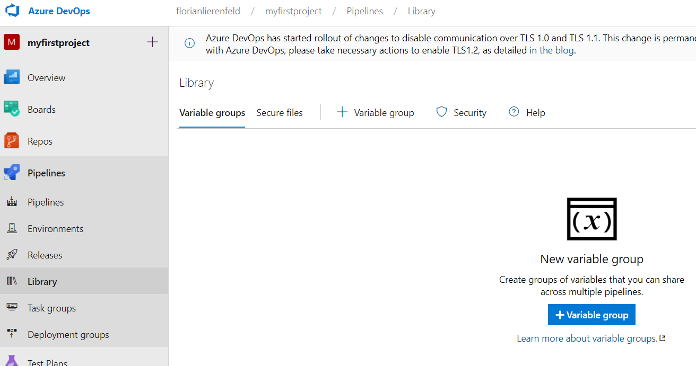<br>


<br>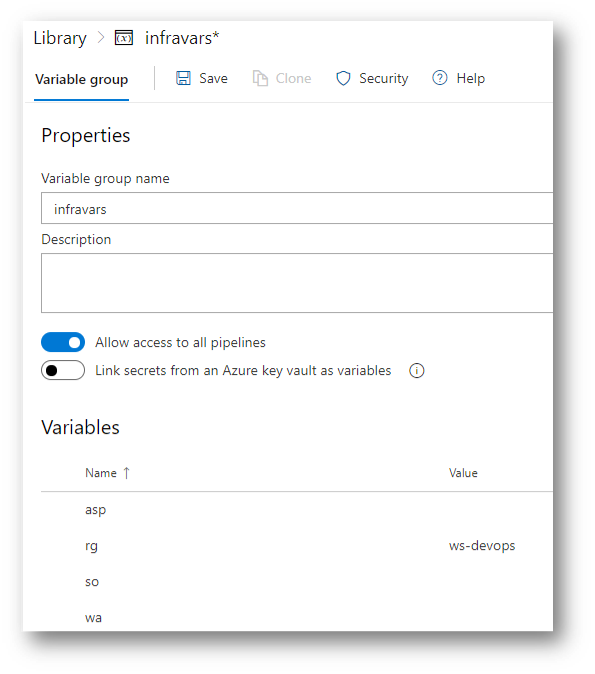<br>

We all use the same Subscription and the Resource Group `ws-devops` but everybody uses his own App Service Plan and his own Webapp.

Therefore, pick unique names e.g. robsplan21 or robswebapp21 for your App Service Plan and Webapp variables.

Use for Resource Group (rg) ws-devops.

* asp = Name of your unique App Service Plan in `ws-devops`
* rg = Name of Resource Group which must be `ws-devops`
* so = Service Connection Name which you have set in your project (Settings -> Service connections)
* wa = World-wide unique name of your Webapp 

Of course, you can use your own variables names, they must correspond with your pipeline.

## Adjusting YAML Pipeline file

The next steps describe the adjustments that have to be done from your side to the existing file `infra-pipeline.yaml` step by step. The picture below shows where you find the file.

<br>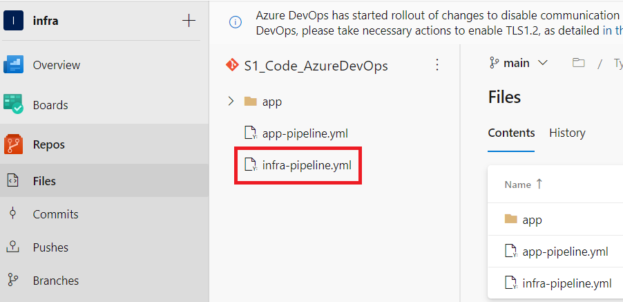<br>

Warning: The formatting of YAML (yml) files is based on spaces and tabs. Therefore the following lines should be copied with care.
It is advised to use Visual Studio Code to validate the copied file.  
Starting with making the variable group available to the pipeline. From now on we can reference any variable that is held in the variable group under libraries (described under 2). Replace the placeholder `<TODO variable group>` with the following code:
```YAML
variables:
- group: infravars
```
The syntax to refer to a key value pair you use the syntax `$(<variable name>)`. `<variable name>` stands for the name of the variable. Thanks to the statement above the expression will be replaced with value of the named key value pair.

Next, we could set a trigger which will run the pipeline after every commit on this repository:
(we set it to none to avoid unwanted pipeline runs). Replace the placeholder `<TODO trigger condition>` with the following code:
```YAML
trigger: none
```

Then we need to set an operating system in which our pipeline will run. Replace the placeholder `<TODO image settings>` with the following code:
```YAML
pool:
  vmImage: ubuntu-latest
```

After that we define the smallest building block of a pipeline that contains our scripting code. The task type `AzureCLI@2`comes with Azure Cli installed so you can execute our commands like would do it on the Azure Portal in the cloud shell. Replace the placeholder `<TODO task>` with the following code:
```YAML
steps:
- task: AzureCLI@2
  displayName: Create WebApp Infra
  inputs:
    azureSubscription: '$(so)'
    scriptType: 'bash'
    scriptLocation: 'inlineScript'
    inlineScript: |
      az appservice plan create -g $(rg) -n $(asp) --is-linux --number-of-workers 1 --sku B1
      az webapp create -g $(rg) -p $(asp) -n $(wa) --runtime "node|10.14"
```

If you want to learn more about the concept of a pipeline you can do it here:

https://docs.microsoft.com/de-de/azure/devops/pipelines/get-started/key-pipelines-concepts?view=azure-devops

## Setup Pipeline in Azure DevOps

The next paragraphs describe how you setup your pipelines and how to run them. The key icon for all subsequent steps is the rocket symbol on the left-hand side.

To **create a pipeline** click on the button "Pipelines" below the rocket symbol.
If no pipelines are defined yet you will only see a button "Create Pipeline" to create ones. Otherwise a creation button and existing pipelines are listed. The screesnhot shows the situation after clikcing on "Pipelines", when no pipelines are defined yet,

<br><br>

Clicking "New pipeline" starts the wizard that takes you through the creation process:
1. **Connect:** Select "Azure Repos Git" as your code source
2. **Select:** Select the repository "S1_Code_AzureDevOps" you created previously via import
3. **Configure:** 
  
    Select "Existing Azure Pipelines YAML file".In the subsequent dialog select the file "infra-pipeline.yaml" from the main branch. Make sure you have the main branch selected and click "Continue":
    <br>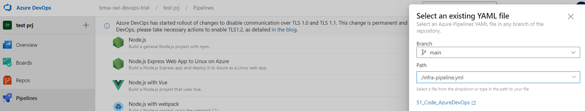<br>

    You will then see the yaml file for review.<br>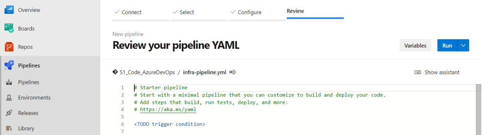<br>
    
    On the top righ-corner you have a button "Run" with a drop down. If you click "Run" two major things happen: (1) A pipeline is created with a default name and (2) the created pipeline is started. Expand the dropdown and select "Save". You will see then a screen as below:
    <br>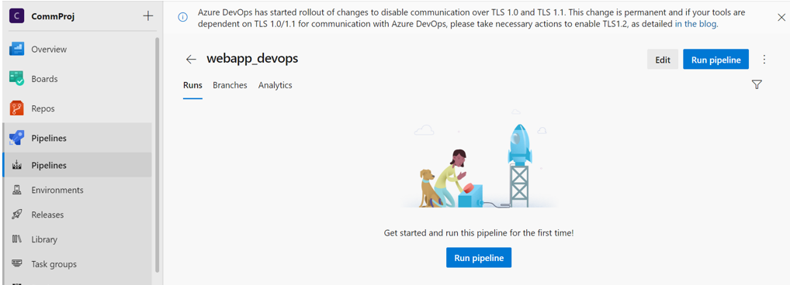<br>
    
    Azure DevOps uses the name of the repo "S1_Code_AzureDevOps" as default name for the saved pipeline. Especially if you have multiple pipelines that does not make so much sense. Therefore we will rename our pipeline to avoid confusion. The following is just one possible way that minimizes the explanations. Click on the arrow next to "S1_Code_AzureDevOps" which will bring you back to the main menu with the rocket icon.

To start operations for an existing pipeline click on "Pipelines" below the rocket symbol to display the existing ones. Hovering over an entry will display an additional context menu represented by three dots "..." at the right-hand side of an entry. Clicking on the dots will allow to trigger various actions such as running the pipeline.
<br>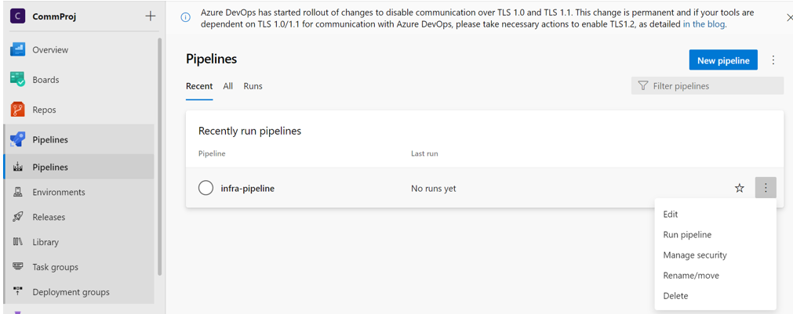<br>

Pick **"Rename/ Move" to rename** the pipeline from the context menu. In the subsequent dialog you can specify a new name. Leave folder name empty and confirm.
<br>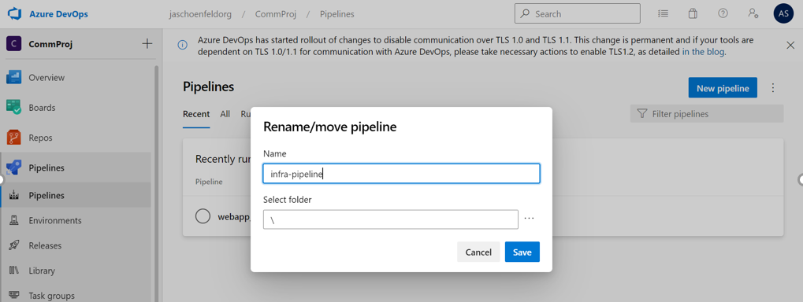<br>

Pick **"Run pipeline" to start a pipeline** from the context menu. Go with the defaults in subsequent dialogs when you are asked for branch name and other things. Azure DevOps will display a new screen that reflects the  pipeline run.

Two explicit approvals are required to run a pipeline the very first time. To grant permission click on the red link `Permission needed`. Clicking the link will display another dialog with two "Permit" buttons (One for the pipeline and one for the variable group). Click each button and confirm when prompted once more. The screenshots below illustrate the described situations.
<br><br>
<br>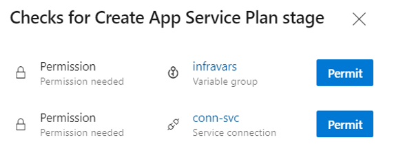<br>
<br>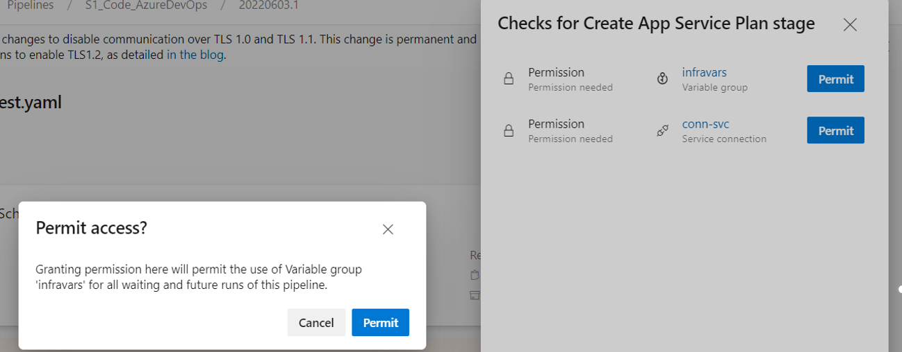<br>

Once confirmed execution will resume. You will see first a summary of your pipeline run. The example below shows intentionally an error situation. The explanation shall enable you to fix an error yourself and retrigger a pipeline run. To track down the error you have to click on the error message.
<br>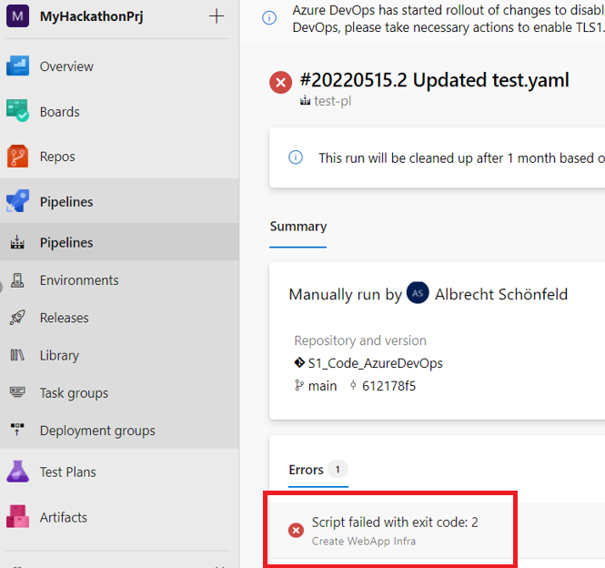<br>

You see now a drill down of the logical steps executed. You can click on the entry to see detailed output in the right-hand side. The icon represents the state of the step (gray = not started; in progress; failed succeeded).
<br><br>

Most of the logical steps you did not program directly but are triggered automatically by Azure DevOps. A few comments regarding the entries you see:
1. **Job:** Results from the default job Azure DevOps assumes. The expandable entries below the Job are the steps the job consists of.
2. **Initialize Job:** Internal standard step to initialize the job
3. **Checkout...** Internal step that transports the designated repo to the execution environment of the pipeline
4. **Create WebApp Infra** That is the step you programmed in YAML
5. **Post-Job...-Re port Build Status:** Internal standard operations

In successful run all steps are either states "Succeded" or "Not started". The screenshot below is not matching 100% our example but illustrates the idea.
<br>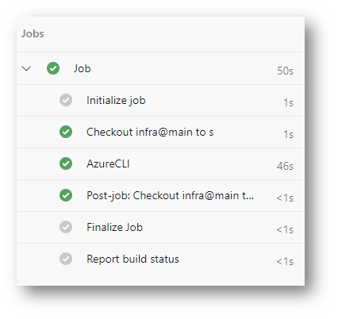<br>

## Check Pipeline Results via Portal

We have created a single user with read permission for the shared resource group we are using in this hackathon. Login into Azure with the following credentials:
- Username: devops_hack_reader@mscloudguild.onmicrosoft.com
- Password: Please contact one of the supervisers

Log in to the [azure portal](https://portal.azure.com). Use the EMail address as indicated above. Go to the resource group `ws-devops` by clicking as follows in the home screen below:
<br>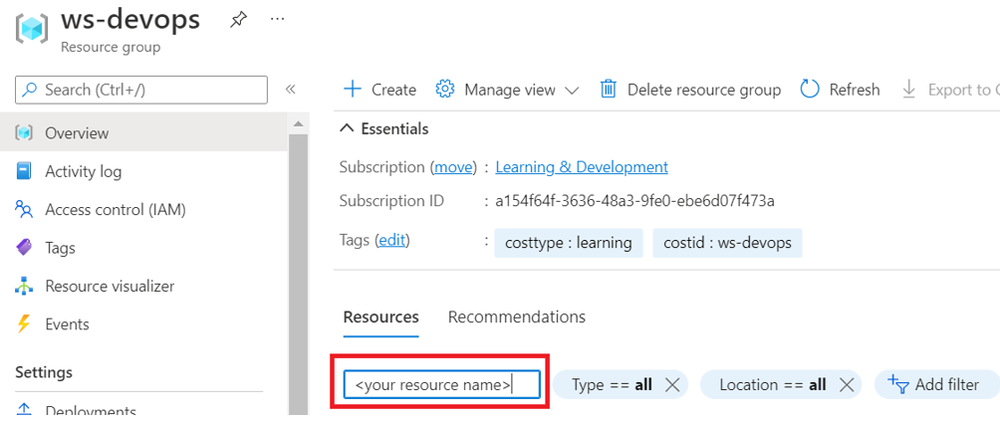<br>

Enter the name of your resources in the red marked field to limit the display. If your pipeline run succeeded you should see two icons in the resource group that have the name you created. If they are there you mastered successfully the infrastructure part.
