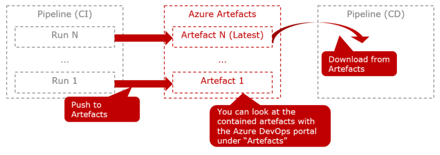

# 1. Introduction to Application Pipeline Split

You should now have Completed the Following things:
1. Setup your Azure DevOps Organization/ Project
2. Setup your Azure DevOps Repository
3. Setup your Azure DevOps Service Connection
4. Setup the Infrastucture
5. Setup Web Site

The idea of this optional task is to give you a chance to get familiar with Azure Artefacts. Azure Artefact is a temporary store where you can store pipeline results such as your build result. In a typical scenario a CI pipeline is compiling the code artefact if the tests succeeded. The artefact is then pushed to Azure artefacts as the last step of the CI-pipeline run. A subseqeunt CD pipeline downloads the artefact for later deployment. The picure below shows the major involved components (Red marks the new component in focus)):

<br><br>

NOTE: THis is an advanced where not everything is given as step by step instruction. Use information from the internet and what you have learnt in previous sections.

# 1. Setting up the Application Pipeline

## Pushing the artefact (CI pipeline)

A special tast type exists For pushing an artefact such as a zip file to Azure artefacts. Not many parameters are needed as the example below shows:
```YAML
# Publish an artefact named 'WebApp'
- task: PublishPipelineArtifact@1
    displayName: Create artefact
    inputs:
    targetPath: '$(build.artifactstagingdirectory)'
    artifactName: 'WebApp'
```

## Downloading the artefact (CD pipeline)

Two scenarios must be distinguished:
1. The artefact is downloaded by the same pipeline
2. The artefact is downloaded by a different pipeline (our case)

The first case is much simpler because it requires very few parameters similar to push. The exmample below shows an example:
```YAML
# Download an artifact named 'WebApp' to 'bin' in $(Build.SourcesDirectory)
- task: DownloadPipelineArtifact@2
  inputs:
    artifact: 'WebApp'
    path: $(Build.SourcesDirectory)/bin
```
A typical use case is when you want to work with the artefact across multiple jobs in the same pipeline. Every jobs starts from scratch and with this download command you can access the artefact very easily.

The second case is our scenario. The relevant task type `DownloadBuildArtifacts` requires the internal id of the pipeline run that created the artefact. One way to tackle this problem is to use Azure Cli scripting. Hence, we will use an extra task that preceeds the `DownloadBuildArtifacts` task. We will use dynmaic variables to transport the values to the download task. To run the required scripting commands we first have to log in to Azure DevOps programatically as shown below:
```YAML
- task: AzureCLI@2
  displayName: Get build id last CI pipeline run
    inputs:
    azureSubscription: ${{parameters.svcConn}}
    scriptType: pscore
    scriptLocation: inlineScript
    inlineScript: |
      # Install extension & login
      az extension add --name azure-devops
      echo $(System.AccessToken) | az devops login
      # Set organization and project
      az devops configure --defaults organization=$(System.TeamFoundationCollectionUri) project=$(System.TeamProject) --use-git-aliases true
```
The following two lines deserve extra explanations:
- `az extension add --name azure-devops` installs the extra package for Azure DevOps that is not coming automatically
- `$(<variable name>)` refers to a dynamic variable. `System.``denotes predefined variables by Azure DevOps that are automatically resolved for you.

Now we are ready to run the commands to solve the two problems outlined above. The command below gives you the internal pipeline id of the CI pipeline and stores it in the shell variable `pipelineId`:

`$pipelineId = az pipelines build definition show --name <name of CI pipeline> --query id -o tsv`

The next command gives you the internal id of the last pipeline run:

`$buildId = az pipelines build list --definition-ids $pipelineId --top 1 --query [0].id`

The starting point of the command are all pipeline runs of the CI pipeline returned as array. Each entry is a json structure. The two filter expressions reduce it to a simple value: (1) `--top 1` discards all entries except for the first one and (2) `--query [0].id` gives the value of the property id within the json structure:

Now we have to store the id in a dynamic variable that can be picked up by the subsequent task as shown below. To reference the value in the subsequnt task use `$(buildId)`:

`Write-Host "##vso[task.setvariable variable=BuildCiId]$buildId"`

We have now completed all steps of our extra Azure Cli. The snippet below shows the complate Azure Cli task and the download. 
```YAML
# 1. Determine id of pipeline that created the artefact
#    The "BuildId" refers to the internal id of the pipeline that created
#    the artefact. This pipeline has multiple runs and we have to find the
#    id of the last run.
- task: AzureCLI@2
  displayName: Get build id last CI pipeline run
  inputs:
    azureSubscription: <your svc connection>
    scriptType: pscore
    scriptLocation: inlineScript
    inlineScript: |
      # Install extension & login
      az extension add --name azure-devops
      echo $(System.AccessToken) | az devops login
      # Set organization and project
      az devops configure --defaults organization=$(System.TeamFoundationCollectionUri) project=$(System.TeamProject) --use-git-aliases true
      # Get the id of the pipeline based on its name
      echo ${{parameters.buildPipelineName}}
      $pipelineId = az pipelines build definition show --name <name of your CI pipeline> --query id -o tsv
      # Filter from the runs the top most one
      $buildId = az pipelines build list --definition-ids $pipelineId --top 1 --query [0].id
      # Publish for next pipeline steps
      Write-Host "##vso[task.setvariable variable=BuildCiId]$buildId"
# 2. Download the labeled artefact into our pipeline
- task: DownloadBuildArtifacts@0
  inputs:
    # Must be set otherwise pipeline is not used
    buildType: 'specific'
    downloadType: 'single'
    buildVersionToDownload: 'specific'
    buildId: $(BuildCiId)
    artifactName: <name of artefact>-$(BuildCiId)
    # Internal identifier of the project id (can be inferred
    # if you retrieve the URL of an artefact)
    project: '$(System.TeamProjectId)'
    # Name of build pipeline for release build as displayed in the
    # Azure DevOps UI (Does not refer to the name of the Yaml filename).
    # Is translated into a number.
    pipeline: <name of your CI pipeline>
    # Resulting path is '$(System.ArtifactsDirectory)/<art-name>/...
    downloadPath: '$(System.ArtifactsDirectory)' 
```

## Split the existing pipeline

So far we have one pipeline that is doing the CI and CD part. The snippet below shows now where you would have to split. The code snippet below illustrates the border between CI and CD in the existing pipeline. The `upload` statement is the last part of CI whereas `stage: Deploy` denotes the CD part:
```YAML
    ...
    - upload: $(Build.ArtifactStagingDirectory)/$(Build.BuildId).zip
      artifact: drop

- stage: Deploy
  displayName: Deploy stage
  ...
```

The basic idea is as follows:
1. Replace the upload with a `PublishPipelineArtifact` task in the existing pipeline. Remove the CD part and store it somewhere else.
2. Create a new CD-pipeline and move the CD part to it
3. Add to the deployment job the two other tasks (AzureCli and `DownloadBuildArtifacts`)

As already stated explaining that in detail would go too far. Therefore, do it stepwise and not all at once. Especially the first step is easy and allows you to inspect the artefact via the portal to gather first experiences.